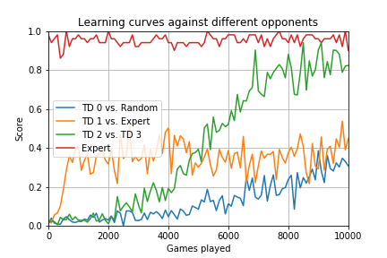

# game-learner

*Game-learner* is a Python module to simulate simple games or puzzles such as [Tic Tac Toe](https://en.wikipedia.org/wiki/Tic-tac-toe) 
(Noughts and Crosses) in order to test different computer-algorithms and methods such as 
reinforcement learning and dynamic programming.

It includes a temporal-difference (TD) learning algorithm that learns to play Tic-tac-toe
as described in Chapter 1 of the [draft 2nd edition](www.incompleteideas.net/book/bookdraft2017nov5.pdf) of Sutton 
and Barto's book *Reinforcement Learning: An Introduction*.

The TD learning algorithm uses a state value function which is updated each time-step as follows:

V(s) ← V(s) + α[reward + γV(s′) − V(s)]

The file [`gamelearner.py`](gamelearner.py) contains three main classes:

- `Player` - abstract parent class for all types of players (or 'agents')
- `Environment` - abstract environment class for constructing specific environments (or 'games')
- `GameController` - controls a game with any number of players

This diagram is a little complicated but shows the main methods and objects that are passed
between the instances of the three classes:


The file also contains three common player-types:

- `RandomPlayer` - a computer player that makes random moves
- `HumanPlayer` - an interface to allow humans to play a game
- `TDLearner` - a simple TD learning algorithm that learns to play from experience


## Tic-Tac-Toe Example

The file [`tictactoe.py`](tictactoe.py) contains classes which inherit from the above:

- `TicTacToeGame` - the game environment (dynamics)
- `TicTacToeExpert` - computer algorithm which plays optimally - should be unbeatable [according to wikipedia](https://en.wikipedia.org/wiki/Tic-tac-toe#Strategy)


### Example usage

```
>>> from gamelearner import *  
>>> from tictactoe import TicTacToeGame
>>> game = TicTacToeGame()
>>> players = [HumanPlayer("Joe"), TDLearner("TD")]
>>> ctrl = GameController(game, players)
>>> ctrl.play()
Game of Tic Tac Toe with 2 players ['Joe', 'TD']
_ _ _
_ _ _
_ _ _
Joe's turn (row, col): 0,0
TD got 0.0 reward.
X _ _
_ _ _
_ _ _
TD's turn (row, col): (0, 1)
X O _
_ _ _
_ _ _
Joe's turn (row, col): 0,1
That position is not available.
Try again.
Joe's turn (row, col): 1,1
TD got 0.0 reward.
X O _
_ X _
_ _ _
TD's turn (row, col): (1, 0)
X O _
O X _
_ _ _
Joe's turn (row, col): 2,1
TD got 0.0 reward.
X O _
O X _
_ X _
TD's turn (row, col): (0, 2)
X O O
O X _
_ X _
Joe's turn (row, col): 2,2
TD got 0.0 reward.
TD got 0.0 reward.
Joe you won!
X O O
O X _
_ X X
Game over!
Joe won in 7 moves
```

Initially, the TDLearner makes random moves but gradually it updates its internal 
value function for each game state it visits until it (slowly) learns to make 
better moves, depending of course on how it's opponents play.

Running `gamelearner.py` instead of importing it will launch a looped game play
where 5 TD Learners play 1000 games against each other before the best of the 
five takes on a human.  After playing the human, the best player is cloned into
five new TD Learners which play another 1000 games against each other... and so
on.

```
$ python tictactoe.py

Play Tic-Tac-Toe (Noughts and Crosses) against the computer.
Enter your name: Joe
Computer is playing 1000 games against a clone of itself...

Training 2 computer players...
0 games completed
100 games completed
200 games completed
300 games completed
400 games completed
500 games completed
600 games completed
700 games completed
800 games completed
900 games completed

Results:
TD: won 413, lost 461, drew 126
TD-clone: won 461, lost 413, drew 126
Now play against it.

Game of Tic Tac Toe with 2 players ['Joe', 'TD']
_ _ _
_ _ _
_ _ _
Joe's turn (row, col): 
```

### Training with an expert

To use the expert player to train a TD Learner player you can use this function:

```
>>> from gamelearner import *
>>> from tictactoe import TicTacToeGame, TicTacToeExpert
>>> game = TicTacToeGame()
>>> computer_players = [TDLearner("TD1"), TicTacToeExpert("EXPERT")]
>>> train_computer_players(game, computer_players)

Training 2 computer players...
0 games completed
100 games completed
200 games completed
300 games completed
400 games completed
500 games completed
600 games completed
700 games completed
800 games completed
900 games completed

Results:
TD1: won 0, lost 613, drew 387
EXPERT: won 613, lost 0, drew 387
>>> train_computer_players(game, computer_players)

Training 2 computer players...
0 games completed
100 games completed
200 games completed
300 games completed
400 games completed
500 games completed
600 games completed
700 games completed
800 games completed
900 games completed

Results:
TD1: won 0, lost 225, drew 775
EXPERT: won 225, lost 0, drew 775
>>> 
```

### Performance testing

There is a also a test metric which tests an algorithm's performance playing
games against an expert player and a player that makes random moves.

```
>>> from gamelearner import *
>>> from tictactoe import TicTacToeGame, TicTacToeExpert, test_player
>>> game = TicTacToeGame()
>>> players = [td1, td2, random_player, expert_player]
>>> for i in range(10):
...     train_computer_players(game, players, 500, show=False)
...     td1_score = test_player(td1)
...     print("Score after %d games: %5.2f" % (td1.games_played, td1_score))
... 
Score after 516 games:  0.03
Score after 777 games:  0.07
Score after 1010 games:  0.10
Score after 1259 games:  0.16
Score after 1515 games:  0.25
Score after 1765 games:  0.27
Score after 1998 games:  0.19
Score after 2256 games:  0.31
Score after 2495 games:  0.36
Score after 2743 games:  0.34
>>> test_player(expert_player)
0.96
```

### Human-only play

If you want to play a game between two humans, call `game_with_2_humans()` as follows:

```
>>> from tictactoe import tictactoe_with_2_humans
>>> tictactoe_with_2_humans(["Jack", "Jill"], move_first=0)

Game of Tic Tac Toe with 2 players ['Player 1', 'Player 2']
_ _ _
_ _ _
_ _ _
Player 1's turn (row, col): 
```


### TD algorithm performance

The TDLearner is currently a strict implementation of the TD(0) algorithm which gradually 
estimates the value of every possible game state by updating the current estimate of the
value of each state it encounters using the current estimate of the subsequent state (a
process known as 'bootstrapping').

Although it is slow, it will eventually learn an 'optimal policy', depending on who it is
playing against and provided certain parameters are optimized.  To illustrate the learning
rates and see how learning depends on what opponent the algorithm trains against, I ran
an experiment where four independent TD learner's are trained in parallel, one against a
random player, one against an expert, and the remaining two against each other and tested
the performance of each at regular intervals during the training process.  

The performance score is based on a test in which 100 games are played, 50 against an 
expert and 50 against a random player.

In this experiment, the parameters for the `TDLearner` objects were initialized as follows:

```
learning_rate        0.1
off_policy_rate      0.0
initial_values       0.5
```

This combination of values produced the best performance against an expert player after 2000 
games.

The following chart shows the learning curves:



Initially, TD 1, the TD algorithm playing against the expert, learns quickly but
soon its performance plateaus.  This could be because the off-policy rate parameter
was set to zero.  This means that the algorithm does not deliberately explore
alternative moves.  It could also be because part of the performance test includes 
games against a random-player which the algorithm does not experience in the 
experiment (during the test, learning is turned off so the algorithm cannot benefit 
from the test experience).

TD player #2 takes a while to get going but does very well playing against another 
TD player, reaching a performance that is not far off expert-level after 10,000 
games.  The "TD 0" player, playing against a random player, learns much more
slowly but eventually overtakes the player that only plays against the expert.
This is probably because it experiences a broader range of states including some
expert moves that the random player will eventually make 'by accident' (the fact
that the random player sometimes makes expert moves is also the reason why the
expert player does not always score 100% in the test).

By the end of the experiment, TD learners #2 and #3 have around 4,680 state-value
estimates in memory whereas TD 1 had only experienced about 910 states playing
against the expert.

The histogram below shows the distribution of values in the value function for
TD 2.


